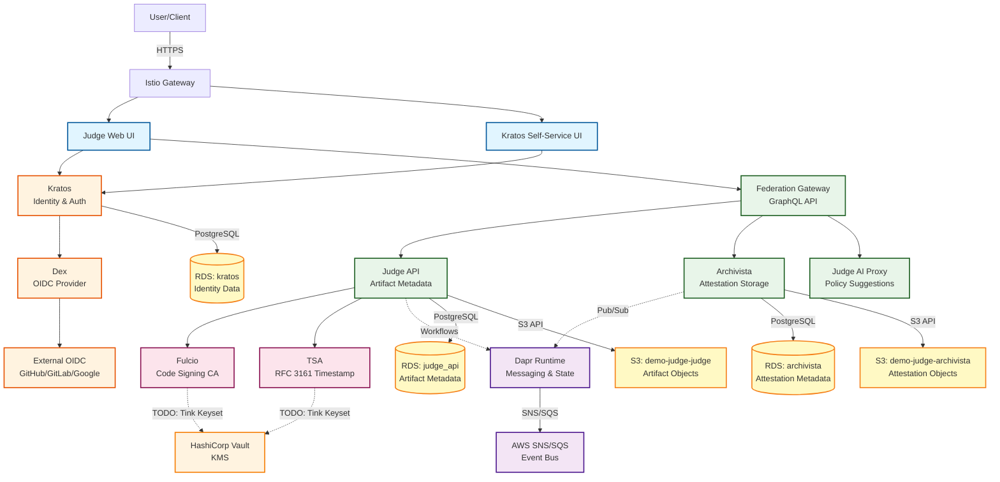

# Judge Platform Component Architecture

This diagram shows the high-level architecture of the Judge platform and how components interact.

## Component Descriptions

### Frontend Layer
- **Judge Web UI**: React-based web interface for platform management
- **Kratos Self-Service UI**: Login, registration, and profile management

### Authentication Layer
- **Kratos**: Identity and user management (Ory Kratos)
- **Dex**: OpenID Connect provider for federated authentication
- **External OIDC**: Integration with GitHub, GitLab, Google, etc.

### Core Services Layer
- **Federation Gateway**: GraphQL API gateway orchestrating backend services
- **Judge API**: Core service for artifact metadata and policy management
- **Archivista**: Attestation storage and retrieval service
- **Judge AI Proxy**: AI/LLM integration for intelligent policy suggestions

### PKI Services Layer
- **Fulcio**: Code signing certificate authority (Sigstore) - **TODO**: Configure with Tink+Vault KMS for key management
- **TSA**: RFC 3161 timestamping authority for provenance - **TODO**: Configure with Tink+Vault KMS for key management
- **HashiCorp Vault**: KMS for encrypting Tink keysets (signing keys)

### Infrastructure Layer
- **Dapr Runtime**: Distributed application runtime for workflows and messaging
- **AWS SNS/SQS**: Event bus for asynchronous communication

### Data Layer
- **RDS Databases**: PostgreSQL 16 databases on shared RDS instance (`demo-judge-postgres`)
  - `judge_api`: Artifact metadata, compliance frameworks, and policy data
  - `archivista`: Attestation metadata and search indices
  - `kratos`: User identity, sessions, and authentication data
  - **CRITICAL**: Each service MUST have a separate database - using shared database causes Atlas migration conflicts
- **S3 Buckets**: Separate object storage per service (IRSA authentication)
  - `demo-judge-judge`: Judge API artifact storage (attestations, SBOMs, policies)
  - `demo-judge-archivista`: Archivista attestation objects and blobs

## Key Patterns

1. **Service Mesh**: Istio provides mTLS, traffic management, and observability
2. **Authentication Flow**: OIDC federation via Kratos and Dex
3. **API Gateway**: Federation Gateway provides unified GraphQL interface
4. **Event-Driven**: Dapr pub/sub for asynchronous workflows
5. **Data Isolation**: Each service has dedicated database and S3 bucket for security and schema independence
   - Prevents migration conflicts between services (Atlas schema versioning)
   - Enables independent service scaling and backup strategies
   - IRSA (IAM Roles for Service Accounts) provides per-service S3 permissions
6. **PKI Key Management** (TODO): Fulcio and TSA will use Google Tink with HashiCorp Vault KMS for secure key storage and signing operations
