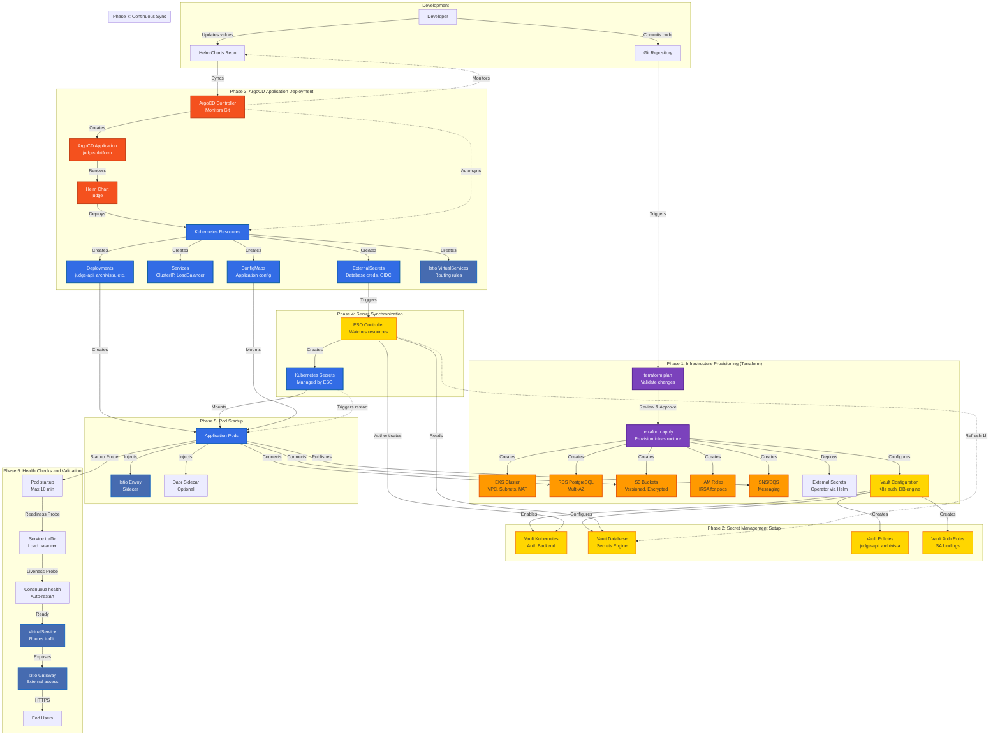

# Deployment Pipeline and GitOps Workflow

This diagram shows the end-to-end deployment process for the Judge platform using Terraform, ArgoCD, and GitOps principles.



## Deployment Phases

### Phase 1: Infrastructure Provisioning (Terraform)

**Prerequisites:**
- AWS credentials configured
- S3 backend for Terraform state
- DynamoDB table for state locking

**Execution:**
```bash
# Initialize Terraform backend
terraform init -backend-config=backend.hcl

# Validate configuration
terraform validate

# Plan infrastructure changes
terraform plan -out=tfplan

# Review plan output
cat tfplan

# Apply changes (requires manual approval)
terraform apply tfplan
```

**Outputs:**
- EKS cluster endpoint
- RDS endpoint
- S3 bucket names
- IAM role ARNs (for IRSA)
- VPC configuration

**Time:** ~20-25 minutes

### Phase 2: Secret Management Setup (Terraform + Vault)

Terraform automatically configures Vault:

**Vault Kubernetes Auth Backend:**
```hcl
resource "vault_auth_backend" "kubernetes" {
  type = "kubernetes"
  path = "kubernetes"
}
```

**Vault Database Secrets Engine:**
```hcl
resource "vault_database_secret_backend_connection" "postgres" {
  backend       = vault_mount.database.path
  name          = "judge-postgres"
  allowed_roles = ["judge-api", "archivista", "kratos"]

  postgresql {
    connection_url = "postgresql://{{username}}:{{password}}@${var.rds_endpoint}:5432/${var.db_name}"
  }
}
```

**Time:** ~2-3 minutes

### Phase 3: ArgoCD Application Deployment

**ArgoCD Application Manifest:**
```yaml
apiVersion: argoproj.io/v1alpha1
kind: Application
metadata:
  name: judge-platform
  namespace: argocd
spec:
  project: default
  source:
    repoURL: https://github.com/testifysec/judge-helm-charts
    targetRevision: main
    path: charts/judge
    helm:
      valueFiles:
        - values.yaml
        - values-production.yaml
  destination:
    server: https://kubernetes.default.svc
    namespace: judge
  syncPolicy:
    automated:
      prune: true
      selfHeal: true
    syncOptions:
      - CreateNamespace=true
    retry:
      limit: 5
      backoff:
        duration: 5s
        factor: 2
        maxDuration: 3m
```

**Sync Waves (Ordered Deployment):**
```yaml
# Wave -1: Secrets and ConfigMaps
argocd.argoproj.io/sync-wave: "-1"

# Wave 0: Core services (judge-api - initializes DB schema)
argocd.argoproj.io/sync-wave: "0"

# Wave 1: Dependent services (archivista, kratos)
argocd.argoproj.io/sync-wave: "1"

# Wave 2: Frontend and gateway
argocd.argoproj.io/sync-wave: "2"
```

**Time:** ~15-20 minutes (full deployment)

### Phase 4: Secret Synchronization (ESO)

**ExternalSecret Lifecycle:**
1. ESO controller detects ExternalSecret resource
2. Authenticates to Vault using ServiceAccount JWT
3. Reads secret from Vault path
4. Creates/updates Kubernetes Secret
5. Refreshes secret every 1 hour (configurable)

**Refresh Interval Configuration:**
```yaml
apiVersion: external-secrets.io/v1beta1
kind: ExternalSecret
metadata:
  name: judge-api-database
spec:
  refreshInterval: 1h  # Sync every hour
```

**Time:** ~30 seconds per secret

### Phase 5: Pod Startup

**Startup Sequence:**
1. **Sidecar Injection**: Istio Envoy + Dapr (if enabled)
2. **Init Containers**: Database migrations (judge-api only)
3. **Secret Mounting**: Kubernetes Secrets as environment variables
4. **Application Start**: Main container starts
5. **Startup Probe**: Waits up to 10 minutes for readiness
6. **Readiness Probe**: Pod accepts traffic when ready
7. **Liveness Probe**: Continuous health monitoring

**Example Startup Probe:**
```yaml
startupProbe:
  httpGet:
    path: /admin/health/ready
    port: 8080
  initialDelaySeconds: 10
  periodSeconds: 10
  failureThreshold: 60  # 10 minutes max
```

**Time:** ~2-5 minutes per deployment

### Phase 6: Health Checks and Validation

**Validation Checklist:**
- [ ] All pods in `Running` state
- [ ] All pods pass readiness probes
- [ ] Kubernetes Secrets created by ESO
- [ ] Database connections successful
- [ ] S3 bucket access verified
- [ ] SNS/SQS messaging working
- [ ] Istio VirtualServices configured
- [ ] External DNS records created
- [ ] HTTPS endpoints accessible

**Automated Validation Script:**
```bash
# Run validation suite
./scripts/validation/validate-deployment.sh

# Check specific components
./scripts/validation/check-prerequisites.sh
./scripts/validation/validate-infrastructure.sh
./scripts/validation/validate-external-secrets.sh
./scripts/validation/wait-for-healthy.sh
./scripts/validation/e2e-test.sh
```

**Time:** ~5-10 minutes

### Phase 7: Continuous Sync (GitOps)

**ArgoCD Auto-Sync:**
- **Frequency**: Every 3 minutes (default)
- **Prune**: Remove resources deleted from Git
- **Self-Heal**: Revert manual changes
- **Retry**: Automatic retry on failure (5 attempts)

**ESO Secret Refresh:**
- **Frequency**: Every 1 hour (configurable)
- **On-Demand**: Trigger via annotation change
- **Rotation**: Vault credential rotation (24h TTL)
- **Pod Restart**: Automatic on secret change (via deployment annotation)

## Rollback Procedures

### Terraform Rollback
```bash
# Revert infrastructure changes
git revert <commit-hash>
terraform apply

# Or restore from Terraform state backup
terraform state pull > current.tfstate
aws s3 cp s3://bucket/terraform.tfstate.backup ./
terraform state push terraform.tfstate.backup
```

### ArgoCD Rollback
```bash
# Rollback to previous revision
argocd app rollback judge-platform <revision>

# Or via UI
# Applications → judge-platform → History → Rollback
```

### Manual Rollback
```bash
# Rollback Kubernetes deployment
kubectl rollout undo deployment/judge-api -n judge

# Rollback specific revision
kubectl rollout undo deployment/judge-api --to-revision=2 -n judge
```

## Disaster Recovery

**RDS Automated Backups:**
- Retention: 7 days
- Point-in-time recovery: 5-minute granularity
- Cross-region replication: Optional

**S3 Versioning:**
- Enabled for all buckets
- Lifecycle policy: 30-day retention
- Cross-region replication: Optional

**Terraform State Backup:**
- S3 versioning enabled
- Daily snapshots to separate bucket
- Encryption at rest (AWS KMS)

## Performance Optimization

**Parallel Deployment:**
- Use ArgoCD sync waves for ordered deployment
- Independent services deploy in parallel
- Database migrations run serially (wave 0)

**Resource Requests:**
```yaml
resources:
  requests:
    memory: "256Mi"
    cpu: "100m"
  limits:
    memory: "512Mi"
    cpu: "500m"
```

**Horizontal Pod Autoscaling:**
```yaml
autoscaling:
  enabled: true
  minReplicas: 2
  maxReplicas: 10
  targetCPUUtilizationPercentage: 70
```

## Monitoring and Observability

**Deployment Metrics:**
- ArgoCD sync status and duration
- ESO secret sync errors
- Pod startup time
- Readiness probe failures
- Database migration duration

**Alerting:**
- ArgoCD sync failures
- Pod crash loops
- ESO authentication failures
- Vault credential expiration
- Database connection errors

**Logging:**
- ArgoCD application logs
- ESO controller logs
- Kubernetes events
- Application startup logs
