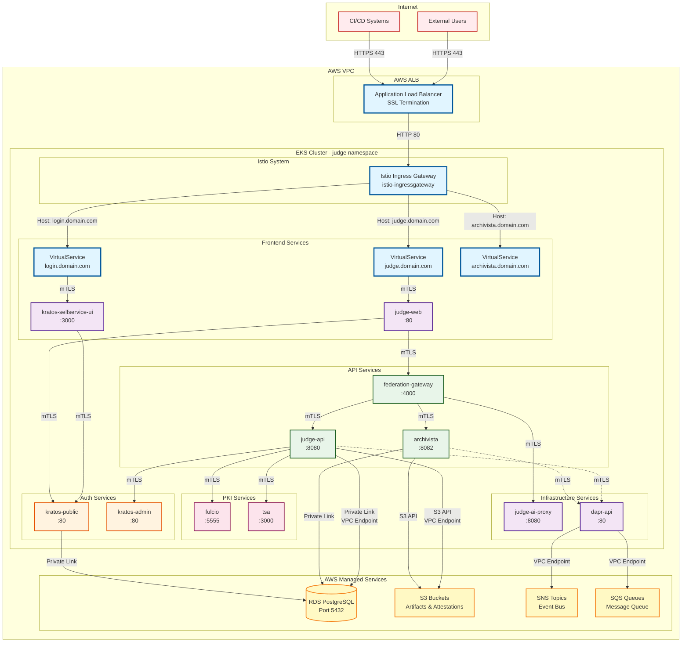

# Network Topology with Istio Service Mesh

This diagram shows the network architecture of the Judge platform using Istio service mesh for traffic management, security, and observability.



## Network Layers

### Layer 1: External Access (ALB)
- **TLS Termination**: SSL certificates managed by ACM
- **Health Checks**: TCP health checks to Istio Gateway
- **Session Affinity**: Cookie-based for stateful apps
- **Timeout**: 2 minutes (ALB default)

### Layer 2: Istio Ingress Gateway
- **Namespace**: `istio-system`
- **Service Type**: LoadBalancer (targets ALB)
- **Ports**:
  - 80 (HTTP) - from ALB
  - 443 (HTTPS) - for direct access
  - 15021 (health check)
- **TLS Mode**: PASSTHROUGH (TLS handled by ALB)

### Layer 3: Istio VirtualServices
Intelligent routing based on HTTP Host headers:

```yaml
# judge-web VirtualService
- match:
  - uri:
      prefix: "/"
  route:
  - destination:
      host: judge-web
      port:
        number: 80

# kratos-selfservice-ui VirtualService
- match:
  - uri:
      prefix: "/"
  route:
  - destination:
      host: kratos-selfservice-ui-node
      port:
        number: 3000

# archivista VirtualService
- match:
  - uri:
      prefix: "/v1"
  route:
  - destination:
      host: archivista
      port:
        number: 8082
```

### Layer 4: Service-to-Service Communication
- **mTLS**: Automatic mutual TLS between all services
- **Protocol**: HTTP/2 with gRPC support
- **Load Balancing**: Round-robin by default
- **Circuit Breaking**: Enabled for resilience

## Security Features

### Istio mTLS
- **Mode**: STRICT (enforced for all traffic)
- **Certificate Rotation**: Automatic (24h TTL)
- **CA**: Istio CA (can be replaced with external CA)
- **Cipher Suites**: TLS 1.3 preferred

### Network Policies
```yaml
# Example: Restrict judge-api egress
apiVersion: networking.k8s.io/v1
kind: NetworkPolicy
metadata:
  name: judge-api-egress
spec:
  podSelector:
    matchLabels:
      app: judge-api
  policyTypes:
  - Egress
  egress:
  - to:
    - podSelector:
        matchLabels:
          app: kratos
  - to:
    - podSelector:
        matchLabels:
          app: fulcio
  - to:
    ports:
    - protocol: TCP
      port: 5432  # RDS
    - protocol: TCP
      port: 443   # S3/SNS/SQS
```

### VPC Endpoints
- **RDS**: PrivateLink for database access (no public IP)
- **S3**: Gateway VPC endpoint (free, no data transfer charges)
- **SNS/SQS**: Interface VPC endpoints for messaging

## Service Port Naming Convention

Istio requires protocol-specific port naming:

```yaml
ports:
- name: http-web        # HTTP traffic
  port: 80
- name: http-api        # HTTP API traffic
  port: 8080
- name: grpc-gateway    # gRPC traffic
  port: 4000
- name: http-admin      # HTTP admin interface
  port: 15000
```

Supported prefixes:
- `http-` or `http2-`: HTTP/1.1 or HTTP/2 traffic
- `grpc-`: gRPC traffic
- `tcp-`: Raw TCP traffic
- `tls-`: TLS-encrypted TCP traffic

## Observability

### Metrics (Prometheus)
- Request rate, latency, error rate
- Service-to-service traffic metrics
- mTLS certificate expiration

### Tracing (Jaeger/Zipkin)
- Distributed tracing across services
- Request flow visualization
- Performance bottleneck identification

### Logging (Fluentd/CloudWatch)
- Centralized log aggregation
- Access logs from Envoy proxies
- Application logs from containers

## Traffic Management Patterns

### Retry Policy
```yaml
retries:
  attempts: 3
  perTryTimeout: 2s
  retryOn: 5xx,reset,connect-failure
```

### Timeout Policy
```yaml
timeout: 10s
```

### Circuit Breaking
```yaml
connectionPool:
  http:
    http1MaxPendingRequests: 1024
    http2MaxRequests: 1024
    maxRequestsPerConnection: 1
  tcp:
    maxConnections: 1024
```

## Dapr + Istio Integration

Dapr sidecar and Istio Envoy proxy coexist:

```yaml
# Dapr port exclusions to prevent conflicts
annotations:
  traffic.sidecar.istio.io/excludeInboundPorts: "50001,9090"
  traffic.sidecar.istio.io/excludeOutboundPorts: "50001"
```

- **Dapr sidecar**: Handles application logic (pub/sub, state, workflows)
- **Istio Envoy**: Handles traffic management and security (mTLS, routing)

## DNS Resolution

### Internal DNS (CoreDNS)
```
<service>.<namespace>.svc.cluster.local
```

Examples:
- `judge-api.judge.svc.cluster.local:8080`
- `kratos-admin.judge.svc.cluster.local:80`
- `archivista.judge.svc.cluster.local:8082`

### External DNS (Route53)
```
<subdomain>.<domain>
```

Examples:
- `judge.testifysec-demo.xyz` → ALB → Istio Gateway → VirtualService → judge-web
- `login.testifysec-demo.xyz` → ALB → Istio Gateway → VirtualService → kratos-ui
- `archivista.testifysec-demo.xyz` → ALB → Istio Gateway → VirtualService → archivista
