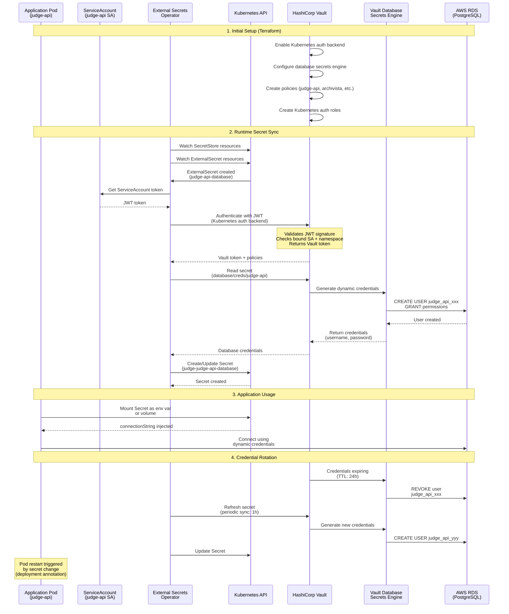

# Secrets Management with External Secrets Operator and Vault

This diagram shows how secrets are managed using HashiCorp Vault and External Secrets Operator (ESO) in the Judge platform.



## Secret Types Managed

### Database Credentials (Dynamic)
- **Path**: `database/creds/{role}`
- **Roles**: `judge-api`, `archivista`, `kratos`
- **TTL**: 24 hours
- **Rotation**: Automatic via Vault lease renewal
- **Storage**: ExternalSecret → Kubernetes Secret

### Application Secrets (Static)
- **Path**: `secret/data/{env}/kubernetes/app/testifysec-judge`
- **Keys**:
  - OIDC client secrets (GitHub, GitLab, etc.)
  - Kratos secrets (cookie, cipher)
  - SMTP connection URI
- **Rotation**: Manual or via CI/CD
- **Storage**: ExternalSecret → Kubernetes Secret

## Authentication Flow

### Vault Kubernetes Auth Backend

```yaml
# ServiceAccount in pod
serviceAccountName: judge-api

# Vault Kubernetes auth role (configured in Terraform)
role: judge-api
bound_service_account_names: ["judge-api"]
bound_service_account_namespaces: ["judge"]
policies: ["judge-api"]
token_ttl: 86400  # 24 hours
```

### ESO SecretStore Configuration

```yaml
apiVersion: external-secrets.io/v1beta1
kind: SecretStore
metadata:
  name: vault
spec:
  provider:
    vault:
      server: "https://vault.example.com"
      path: "kubernetes"
      version: "v2"
      auth:
        kubernetes:
          mountPath: "kubernetes"
          role: "judge-api"
          serviceAccountRef:
            name: "judge-api"
```

### ESO ExternalSecret Configuration

```yaml
apiVersion: external-secrets.io/v1beta1
kind: ExternalSecret
metadata:
  name: judge-api-database
spec:
  refreshInterval: 1h
  secretStoreRef:
    name: vault
    kind: SecretStore
  target:
    name: judge-judge-api-database
    creationPolicy: Owner
  data:
  - secretKey: connectionString
    remoteRef:
      key: database/creds/judge-api
      property: connectionString
```

## Security Benefits

1. **No Static Credentials**: Database passwords generated dynamically
2. **Automatic Rotation**: Credentials expire after 24h TTL
3. **Least Privilege**: Each service has unique database user with minimal permissions
4. **Audit Trail**: All secret access logged in Vault
5. **Centralized Management**: Single source of truth for secrets
6. **Encryption at Rest**: Vault encrypts all secrets
7. **Fine-Grained Access**: Vault policies control who can read what

## Terraform Integration

All Vault configuration is managed via Terraform:
- Kubernetes auth backend setup
- Database secrets engine configuration
- Policy definitions
- Auth role bindings

See `examples/terraform/aws/` for complete Terraform modules.
